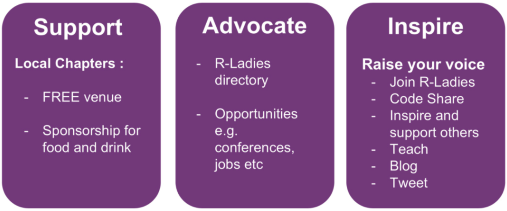

layout: true
    <div class="my-footer"></div>


```{r setup, include=FALSE}
options(htmltools.dir.version = FALSE)
```

---
class: center

# Welcome!
### You are in the right place!
*whether you are an **R-novice** or an **R-expert**!*
```{r rlel-meetupheader, out.width = "500px", echo=FALSE}

```

***

.left[
- <i class="fa fa-pencil fa-fw"></i> Please fill out our **Getting Started** survey: **bit.ly/rlaurora-kickoff** 
- <i class="fa fa-meetup fa-fw"></i> If you are here, please make sure you have RSVP'ed on Meetup!
- <i class="fa fa-sign-in fa-fw"></i> Join us: **bit.ly/rl-aurora-meetup**
]

---
class: center, inverse
# Let us know you!

.left[
### Pick up some `r emo::ji("pizza")`
### Find someone you've not met before! <br>
### Find out their:
1. Name <br>
2. Where are they from? <br>
3. How & When did they start using R? <br>
4. One interesting factoid about them! <br> <br>

### Introduce them to us! `r emo::ji("smiley")`
]

---
class: center

# Agenda
.pull-left[ .left[
### Intro
* to each other <i class="fa fa-check fa-fw"></i>
* to R-Ladies
* to R-Ladies East Lansing

### R
* Snapshot: R `r emo::ji("question")`
* Snapshot: Fun with R
* Snapshot: Data Vis. w/ R `r emo::ji("question")`
]]

.pull-right[ .left[
### Activities
- Topics for future meetups!

- Getting involved!

- Sign up

]]

---
class: center
# R community

```{r r-community-obsession, out.width = "600px", echo=FALSE}

```

<i class="fa fa-twitter fa-fw"></i>Credits: @DynamicWebPaige

---
class: center
# Who we R
```{r rladies-whoweare, out.width = "300px", echo=FALSE}

```

**Credits:** Lucy D'Agostino McGowan | R-Ladies Nashville

---
class: center
# Where we are: R-Ladies Worldwide 
```{r rladies-collage, out.width = "400px", echo=FALSE}

```

```{r rshinylady-map, out.width = "500px", out.height = "400px", echo=FALSE}

```

**Credits:** R-Ladies Global Dashboard 

---
class: center
# R-Ladies: A force for good

.pull-left[
.left[
**LatinR** | `r emo::ji("argentina")` `r emo::ji("brazil")` `r emo::ji("uruguay")` `r emo::ji("chile")` <br>
**ConectaR** | Costa Rica <br>
**Call of Data** | R-Ladies Madrid `r emo::ji("spain")` <br>
**Working with PAWS** | R-Ladies Philly `r emo::ji("us")` <br>
**UseR** | R-Ladies Global `r emo::ji("earth")` <br>
**R-Ladies Abstracts** | R-Ladies Global `r emo::ji("earth")` <br>
**R-consortium** | policy change <i class="fa fa-arrow-right fa"></i> safe & inclusive events | R-Ladies Global `r emo::ji("earth")`
]]

.pull-right[
```{r rladies-philly-madrid, out.width = "200px", echo=FALSE}

```
]
--

```{r rladies-taipei, out.width = "400px", echo=FALSE}

```

---

class: center, inverse
# R-Ladies Aurora
## Things we could do `r emo::ji("thinking")`

<i class="fa fa-eye fa"></i> Choose topics you would like to (Learn | Teach | Help) <br> <br>
<i class="fa fa-sticky-note fa"></i> Pick the corresponding large stickies <br> <br>
<i class="fa fa-pencil fa"></i> Write your names <br> <br>
<i class="fa fa-check fa"></i> Stick them below the topics of your interest <br> <br>
<i class="fa fa-plus fa-fw"></i> Feel free to add additional comments/ideas in your stickies <br> <br>
<i class="fa fa-search fa-fw"></i> Find one of the co-organizers if you need help <br> <br>

---
class: center
# Get involved
```{r rladies-gettinginvolved, out.width = "500px", echo=FALSE}

```

--

**Learn <i class="fa fa-leanpub fa-fw"></i> <br>
Present/Teach/Lead discussions `r emo::ji("teacher")` <br>
Be an R helper: Technical <i class="fa fa-terminal fa-fw"></i> <br>
Social `r emo::ji("butterfly")` <i class="fa fa-twitter fa-fw"></i> <i class="fa fa-meetup fa-fw"></i> <br>
Website & Blogs: <i class="fa fa-github fa-fw"></i> <i class="fa fa-file-code fa-fw"></i> <br>
Content management: <i class="fa fa-github fa-fw"></i> <i class="fa fa-google fa-fw"></i>Drive**

---
class: center, inverse
# Get involved

.pull-left[.left[
Learn <i class="fa fa-leanpub fa-fw"></i> <br> <br>
Present/Teach/Lead discussions `r emo::ji("teacher")` <br> <br>
Be an R helper: Technical `r emo::ji("computer")` <br> <br>
]]
.pull-right[.left[
Social `r emo::ji("butterfly")` <i class="fa fa-twitter fa-fw"></i> <i class="fa fa-meetup fa-fw"></i> <br> <br>
Website & Blogs: <i class="fa fa-github fa-fw"></i> <i class="fa fa-file-code fa-fw"></i> <br> <br>
Content management: <i class="fa fa-github fa-fw"></i> <i class="fa fa-google fa-fw"></i>Drive <br>
]]
***
<br> <br>
```{r rladies-gettinginvolved-qrcode, out.width = "200px", echo=FALSE}

```


---
class: center, inverse
# Next meeting(s)?
### Show of hands! `r emo::ji("raised")`

**How often should we meet?** `r emo::ji("calendar")` Biweekly? <br> <br>
--

**Fall schedule** `r emo::ji("fallen leaf")` Every other Thursday, 5-630p? <br> <br>
--

***

**First 3 meetings** `r emo::ji("lightning")` Lightning talks? <br> <br>
How do you use R in your work? <br>
Cool R packages?
--

***

## Please sign up! <br>


---
class: center
# bioC 2024 Watch Party!
```{r rladies-bioC2024, out.width = "600px", echo=FALSE}

```

**Credits:** BioC 2024 | www.bioc2024.bioconductor.org <br> <br>
Virtual registration for BioC is still open <br>
(especially affordable for trainees @ $10)

---
class: center
# Acknowledgements

.pull-left[ .left[

#### People
- Janani Ravi <i class="fa fa-university fa-fw"></i> DBMI, CU Anschutz
- Arjun Krishnan <i class="fa fa-university fa-fw"></i> DBMI, CU Anschutz

#### R-Ladies
- R-Ladies East Lansing for kick-off slides template
]]

.pull-right[ .left[
#### Packages & communities
- Xaringan theme <i class="fa fa-github fa-fw"></i> yihui/xaringan
  - R-Ladies `r emo::ji("argentina")` <i class="fa fa-github fa-fw"></i> rbind/apreshill
- KnitR, R Markdown, remark.js
- Emo, GiphyR, FontAwesome
- MeetupR | Gabriela de Queiroz `r emo::ji("us")` <i class="fa fa-github fa-fw"></i> rshinylady
- R-Ladies Global `r emo::ji("earth")` <i class="fa fa-slack fa-fw"></i> <i class="fa fa-github fa-fw"></i>
- R-Ladies Remote `r emo::ji("satellite")` <i class="fa fa-slack fa-fw"></i>

#### Today's Sponsor!

```{r jravilab, out.width = "100px", echo=FALSE}

```
JRavi Lab, DBMI
]]

--

<i class="fa fa-users fa-fw"></i> _All you folks for being here for our Kick-off meeting!_

--


---
class: center, inverse
# Find us Online!

.pull-left[ .left[ 
#### R-Ladies Aurora
<a href="mailto:aurora.colorado@rladies.org"><i class="fa fa-paper-plane fa-fw"></i>&nbsp; aurora.colorado@rladies.org</a><br>
<a href="http://twitter.com/RLadies_Aurora"><i class="fa fa-twitter fa-fw"></i>&nbsp; @RLadies_Aurora</a><br>
<a href="http://meetup.com/rladies-aurora/"><i class="fa fa-meetup fa-fw"></i>&nbsp; rladies-east-lansing</a><br>
<a href="http://github.com/rladies-aurora"><i class="fa fa-github fa-fw"></i>&nbsp; @rladies-aurora</a><br>
<a href="https://discord.gg/xzvB4QXK"><i class="fa fa-slack fa-fw"></i>&nbsp; https://discord.gg/xzvB4QXK</a><br>

##### Global
<a href="https://rladies.org"><i class="fa fa-link fa-fw"></i>&nbsp; rladies.org</a><br>
<a href="http://twitter.com/RLadiesGlobal"><i class="fa fa-twitter fa-fw"></i>&nbsp; @RLadiesGlobal</a><br>

]]

.pull-right[ .left[ 
#### Organizers
- Jade Young <br> 
- Janani Ravi <br> 
- Keenan Manpearl <br>  
- Kewalin Samart <br>  
- Stacey Collister <br>  
<a href="mailto:aurora.colorado@rladies.org"><i class="fa fa-paper-plane fa-fw"></i>&nbsp; aurora.colorado@rladies.org</a><br>
]]
